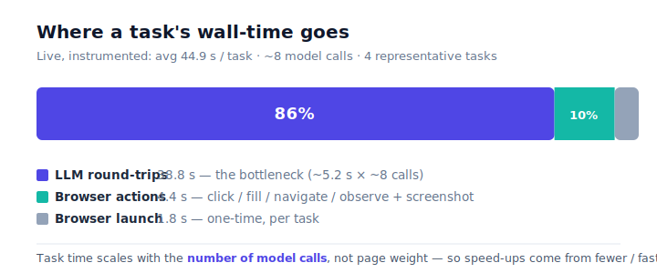
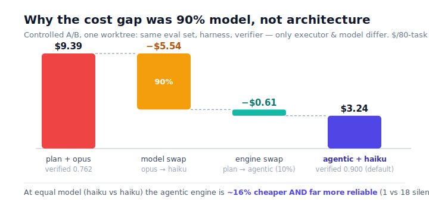
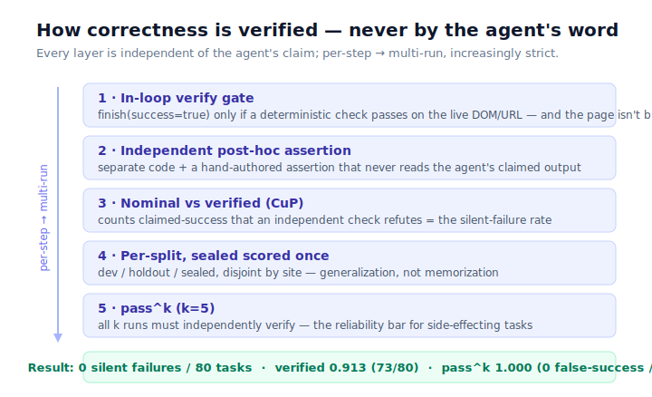

# Analysis — browser-agent

This report covers the four things the assignment asks an analysis to address:
**runtime performance, cost, scalability, and how correctness is verified.** The last is the hard
one — an autonomous agent will happily *claim* success on a page it never checked. System design
lives in the [README](README.md); this document is only the analysis.

*The design in one line (full design in README):* **one language-model session drives the browser
step by step (the *agentic* engine), and a deterministic check — never the model's word — decides
success.** This was not the first design. The project began with a deterministic
**`script-orchestration`** engine (a plan-then-execute design: the model writes a plan once, then
Python executes it step by step — "keep the LLM out of the loop"), then **switched after a
controlled measurement showed the agentic loop was both more reliable and not more expensive**
([§2](#2-cost)). The old engine is kept, selectable with `AGENT_MODE=script-orchestration`, but is
no longer the default (`backend/app/main.py`).

*Where the numbers come from.* Reliability/cost: the eval harness over a self-built **80-task live
set** (`eval/eval_set/live_real_world.yaml`) and a controlled A/B
(`research/executor-ab-plan-mode-vs-llm-in-loop.md`). Runtime: a live instrumented run of 4
representative tasks against the deployed container, timing real emitted events. Reproduce with
`python -m eval.run_live_tier` and `python -m pytest -m "not live" -q`.

> **Two terms, used throughout.** *Nominal* success = the agent ended claiming success. *Verified*
> success = an independent check confirmed the goal on the final page. The gap between them is the
> **silent-failure rate** (CuP) — the headline reliability number.

---

## 1. Runtime performance

**Wall-time is dominated by the language model, not the browser.** The agentic engine runs one
tool-calling session per task; between each model decision the Playwright action runs in
milliseconds. To see *where* the time actually goes, a live run instrumented 4 representative
tasks against the deployed container and bucketed wall-time by real event timestamps (browser
launch → LLM round-trips → Playwright tool-exec):



| Task (live, measured) | Total | Launch | LLM round-trips | Tool-exec | Calls | LLM % |
|---|---|---|---|---|---|---|
| docs.python.org (2-hop nav) | 20.9 s | 3.0 s | 17.2 s | 0.7 s | 3 | 83% |
| Wikipedia (autocomplete) | 36.2 s | 1.0 s | 33.5 s | 1.7 s | 7 | 92% |
| GOV.UK (2-hop browse) | 54.8 s | 1.6 s | 43.1 s | 10.1 s | 8 | 79% |
| amazon.com (search + click) | 67.9 s | 1.5 s | 61.2 s | 5.2 s | 13 | 90% |
| **Average / task** | **44.9 s** | **1.8 s (4%)** | **38.8 s (86%)** | **4.4 s (10%)** | **7.8** | **86%** |

- **The bottleneck is the model round-trip: ~86% of wall-time, ~5.2 s per call × ~8 calls.** The
  Playwright actions (click/fill/navigate/observe + screenshot) are only ~10%, and browser launch
  ~4%. Task time scales with the **number of model calls**, not page weight — the 3-call task
  finishes in 21 s, the 13-call task in 68 s.
- **What keeps the call count down is filtered perception.** `observe` returns only the
  interactive elements whose accessibility name relates to the target, never the whole page
  (`backend/app/agent/agentic/cdp.py`), so each round-trip's input stays small and the loop needs
  ~8 calls, not 30.
- **The loop is bounded** so a stuck task ends cleanly instead of running forever
  (`backend/app/agent/agentic/skill.py`):

  | Bound | Value | Why |
  |---|---|---|
  | Tool-call budget | 25 calls | force a wrap-up before the wall-clock |
  | Session timeout | 120 s | hard cap per task |
  | Per-handler timeout | 15 s | one wedged navigation can't stall the session |

- **Where future speed-ups are — and aren't.** Because 86% of the time is the model, the only
  levers that matter are **(a) fewer round-trips** (smarter perception / a model that needs fewer
  steps), **(b) a lower-latency model per call**, and **(c) prompt caching** to cut per-call
  latency. Optimizing the browser side (the 10%) or launch (the 4%) cannot move the headline.
  This is the same lever that drives cost ([§2](#2-cost)): the model call is the unit of both time
  and spend.

*Aside — the offline path is sub-second.* The deterministic pieces (perception filtering, the
verify gate, `detect_block`) are local DOM/arithmetic work; the unit suite of 233 tests runs
network-free in minutes. The wall-time above is entirely the model + the live network.

---

## 2. Cost

**The GitHub Copilot subscription is flat-rate, not per-token.** Every model call routes through
the Copilot SDK used as a gateway, so there is no per-token bill. The resource that actually binds
is **requests per task** (~8–10), against the Copilot premium-request quota and rate limit — not
dollars. Dollar figures below are *modeled* from Copilot's own token ledger
(`Σ total_nano_aiu / 1e11 ≈ USD`) for comparison only.

### 2.1 The experiment — and why we migrated from `script-orchestration`

The switch from `script-orchestration` to the agentic engine was an evidence decision, not a taste
one. It rests on **a controlled A/B** (`research/executor-ab-plan-mode-vs-llm-in-loop.md`) designed
to answer one precise question: *for the same task set, which executor **architecture** wins on
verified-rate, silent-failure (CuP), and cost — and how much of any cost gap is **architecture**
versus **model choice**?*

**The design — three configs, to disentangle model from architecture.** A naive "old vs new" run
would confound the architecture with the model (`script-orchestration` plans with the expensive
`claude-opus-4.8`; the agentic engine runs one cheap `claude-haiku-4.5` session). So the legacy
engine was run **twice**, giving three configs:

| Config | Architecture | Planner model | Exec model | What it isolates |
|---|---|---|---|---|
| **A-haiku** | `script-orchestration` | haiku | haiku | **model held identical** → the architecture's own worth vs B |
| **A-opus** | `script-orchestration` | opus | haiku | the engine's production config + a faithfulness anchor |
| **B** | agentic (LLM-in-loop) | — (self-plans) | haiku | the agentic engine, unchanged |

`A-haiku vs B` is the clean-science number (same model, only the architecture differs);
`A-opus vs A-haiku` is what the expensive planner alone buys.

**The invariants — what makes it clean science.** Both engines were placed in **one worktree** so
the eval set (sha256 `7dd278b7…`), harness, scoring, browser provider, and cost formula are
byte-identical; **only the executor differs**, selected at runtime by `AGENT_MODE`. Success is
graded by the **independent** `eval/verify` state-check — *never* the agent's self-report — for
every config. As a faithfulness anchor, **A-opus reproduced a prior independent head-to-head to the
cent** ($9.39), confirming the platform is a faithful reproduction.



| Engine | Model | Verified | Silent failures (CuP) | Cost | Calls/task | $/task |
|---|---|---|---|---|---|---|
| `script-orchestration` | haiku | 0.500 (40/80) | 18 | $3.85 | 3.4 | $0.048 |
| `script-orchestration` | opus planner | 0.762 (61/80) | 10 | $9.39 | 1.9 | $0.117 |
| **agentic (default)** | **haiku** | **0.900 (72/80)** | **1** | **$3.24** | **10.4** | **$0.040** |

*(`internet_modal` was counted as a silent failure in every column but was later found to be a
verifier case bug — engine-independent, so the deltas are unaffected; the corrected default is
73/80, CuP 0.)*

**The result, in three readings:**

1. **Architecture alone (A-haiku vs B, model held):** verified **0.500 → 0.900 (+40 pp)**, silent
   failures **18 → 1 (18× fewer)**, and **~16% cheaper** *despite 3× more calls* — filtered
   per-step perception keeps each call small, where `script-orchestration` re-sends a full-page
   perception.
2. **What the opus planner buys (A-haiku → A-opus):** +26 pp verified, but **2.4× the cost** — and
   it *still loses* to agentic-on-haiku (0.762 vs 0.900) at ~2.9× the price.
3. **Decomposing the old "`script-orchestration` is ~5× cheaper" belief** ($9.39 → $3.24): the model swap
   (opus → haiku) is **−$5.54 ≈ 90%** of the gap; the architecture swap is **−$0.61 ≈ 10%**. The
   apparent cost win was *mostly the model*, not the architecture.

**Why `script-orchestration` silently fails — the structural reason.** Its planner commits to
a-priori steps from a *full-page* snapshot, then Python executes them blind to what each step
actually lands on. When a step hits a login wall or the wrong page, the engine runs its plan and
**claims success against state it never re-checked** — `nominal=True, verified=False`. This is the
**planner-open-loop ceiling**, and it is why CuP scales with planner weakness (B 1, A-opus 10,
A-haiku 18). The localized step-repair fix the engine carries closes a *different* hole (replan
dropping a future goal), not this one. The agentic loop avoids the ceiling **by construction**: it
sees the live page at every step, so it adapts and, on a wall, abstains honestly.

So we migrated because the agentic engine is **more reliable *and* not more expensive at equal
model**; the loser is kept selectable for honest comparison.

### 2.2 A cost lever we have NOT measured yet (future exploration)

Every figure above is on **one model — `claude-haiku-4.5`.** We have **not** run a model sweep, and
§1 says why that matters: **cost and time are both `calls × per-call`.** A more expensive but more
capable model might reach the goal in a **more efficient trajectory** — fewer round-trips, fewer
dead-end retries — and so be *cheaper and faster overall* despite a higher per-call price. The
A-opus row hints at the opposite extreme (pricey *and* the wrong kind of calls), but the middle is
unmapped. The honest next step is a per-model sweep (haiku → sonnet → opus as the *in-loop* model)
scored on verified-rate **and** calls/task **and** $/task together — a more capable model is a win
only if its trajectory shrinks enough to pay for its price. Noted as future work, not claimed.

---

## 3. Scalability

"Scalability" here means three different things; the system is honest about each.

### (a) Runtime / throughput

- **Stateless, one ephemeral browser per task.** Each task opens its own browser context
  (~300–500 MB) and recycles it on close (`backend/app/browser/`), so no state leaks between tasks
  and workers are independent. Horizontal scale is just "run more workers" — there is no shared
  session to coordinate.
- **The ceiling is the model rate limit, not CPU/RAM.** Since 86% of a task is model round-trips
  (§1), throughput is bounded by the **Copilot premium-request quota**, not browser memory. Adding
  workers helps only until the quota binds.
- **Honest limit:** the deployment is a single Azure Container Apps replica today; a work-queue +
  autoscale shape is **designed-for, not built**.

### (b) Code extensibility — can the structure absorb more perception, more checks, more recovery?

The expensive, risky parts sit behind stable seams; the report is honest about which are clean
plug-ins and which are coupling.

- **A new executor engine — clean.** The agentic and `script-orchestration` executors share the
  exact constructor and the same `run(task) -> AsyncIterator[Event]` stream, selected by
  `AGENT_MODE` (`backend/app/main.py`). The frontend and eval harness consume either **unchanged** —
  this is what made the §2 A/B clean science (only the executor varied), and a third engine slots in
  the same way.
- **A new bot-wall / block signal — clean, already proven.** `detect_block` (`app/agent/verify.py`)
  is four ordered marker lists (URL / visible widget / body text / challenge-host-in-HTML). Two
  signals were added this way with no structural change: the modern Cloudflare "Just a moment…"
  interstitial (two body-text markers) and DataDome (the `captcha-delivery.com` challenge host,
  gated on an empty body). Each new wall type is a list entry, not a rewrite.
- **A new verification check — clean.** Success is graded by small deterministic primitives
  (`url_contains` / `selector_text_equals` / `text_visible`) in `app/verify/state.py`; a new check
  is a new primitive + one branch, and it is **shared** by the eval harness and production so a fix
  lands once.
- **A swappable browser runtime — clean.** `BrowserProvider` wraps the browser with headless
  Playwright as default and a **CDP escalation seam** for a real stealth browser (Steel.dev /
  Browserbase tier) — the seam that would turn a genuine 403 wall into a recoverable case.
- **Failure-handling strategy — partly clean.** Failure *categories* are an enum (`classify.py`) and
  the `script-orchestration` engine has an explicit recovery module (`recover.py`); the agentic
  engine's recovery is driven by the in-loop prompt (`skill.py`) + the finish gate + a
  rejected-finish abstain cap. Adding a *category* is clean; changing the *agentic recovery policy*
  means editing the prompt contract — honest coupling, because the model (not a dispatch table)
  chooses the next strategy.

### (c) Eval toolchain — can `eval/` grow cheaply?

Yes; this scales better than any single engine seam.

- **More cases — append-only YAML, no code change.** `eval_set/*.yaml` are pinned task specs;
  `run_live_tier.py` and `loader.py` consume them, so adding cases is data, not code.
- **Designed by *purpose*, not volume.** Every case carries a `purpose` tag (the one capability or
  failure-mode it tests); redundant same-purpose filler was pruned (147 → 80). Per-purpose scoring
  comes from a generic group-by, so a **new purpose is one tag** and a new failure-mode family is a
  new file (`mechanisms.yaml`, `diagnostic.yaml`) — not a harness edit.
- **The splits are enforced in code.** dev / holdout / sealed are disjoint **by site**, and the
  loader **refuses to score the sealed split** except an explicit `--sealed` pass — a guard against
  accidental peeking / selection over-fit, not just a convention.
- **Standard, repeatable scoring.** `scoring.py` (nominal-vs-verified / CuP), `passk_diag.py`
  (pass^k, k=5), `report.py`, `audit.py` give one standard way to score any new case set, and the
  two-pass admission probe (`validate_candidates.py`) is reused to admit new cases. Exploring a new
  capability is "add tagged YAML → run the standard harness" — exactly the loop used to grow the set
  to 80.

---

## 4. How correctness is verified (the agent cannot grade itself)

The hard problem in agent reliability is that **the agent that ran all the steps will report
success on a page it never checked.** So the whole verification design follows one rule:
**self-report is never accepted as success.** Every check below is independent of the agent's claim,
layered from a per-step gate to an independent post-hoc assertion to a multi-run bar:



### 4.1 Why "success" needs a supplied criterion — and where it comes from

A natural-language browser task has **no universal ground truth.** "Open the json module page",
"find this book's price", "reach Ask HN" — each has a *different*, task-specific definition of done.
With no task-specific check, the only signal available is the agent's own claim — **nominal**
success — which is exactly the signal we do not trust. **The one thing that turns *nominal* into
*verified* is a deterministic, discriminating, task-specific success check.** So the system always
gets that check from outside the agent, in both places it runs:

- **In the eval harness, the task author writes it.** Each of the 80 cases ships a hand-authored
  assertion (`url_contains` / `h1_equals` / `selector_text_equals`) that is true **only if** the
  task is actually done, admitted by the two-pass gate (§4.4).
- **In production, the user supplies it** (the success-criterion field in the frontend) — because
  only the caller knows what "done" means for *their* task. `backend/app/main.py` validates it
  (`_parse_criterion`) and wraps it (`_make_verify_hook`) to run **the same `state_check` the eval
  harness uses** on the live final page. Two design choices make it trustworthy rather than
  decorative:
  - **It can't be gamed into an accidental pass.** Only deterministic, *discriminating* keys are
    accepted; a loose body-text `text_contains` (or any unknown key) is **rejected with HTTP 400**.
    A criterion that would "pass on the wrong page" is refused at the door.
  - **It also gates the agent's own finish.** Production threads the criterion into the agentic
    **finish gate** (#4b): the agent may not even `finish(success=true)` unless the user's criterion
    holds on the live page — not just its own model-chosen verify.

This is why the verdict is labeled honestly: **with** a criterion, "verified ✓" means that
independent check actually ran and passed (and a silent failure shows as `verified=false` even when
the agent claims success); **without** one there is nothing to assert against, so the run is shown
as **"actions completed — not goal-verified"** — deliberately *not* a verified pass. We make no
blanket production "verified" guarantee, because verification is only as real as the criterion
behind it.

### 4.2 Results

| Measure | Result | Scope |
|---|---|---|
| Verified rate (total) | **0.913 (73/80)** | all 80 tasks |
| **Silent-failure rate (CuP)** | **0/80** | every miss is an honest abstain or a flagged failure, never a false claim |
| pass^k (k=5; all 5 runs must verify) | **1.000**, false-success **0/8** | 8 adversarial diagnostic tasks |

Per split, never pooled (pooling lets easy tasks hide hard ones):

| Split | Tasks | Verified | Silent failures |
|---|---|---|---|
| dev | 39 | 0.923 | 0 |
| holdout | 21 | 0.810 | 0 |
| sealed (scored once) | 20 | 1.000 | 0 |
| **Total** | **80** | **0.913 (73/80)** | **0** |

**Silent-failure rate is the headline metric:** the system is allowed to be wrong only when it
*says so*. A silent failure = a claimed success that an independent check refutes; there are none on
the eval set. **pass^k** then raises the bar for reliability under repetition — on 8 adversarial
tasks (intent-drift decoys, renamed / hidden-menu / control selector perturbations, dead-button and
impossible-goal stagnation, synonym-locate) all 5 of 5 runs verified with **0 false successes**.

### 4.3 The independent checks (why a claim can't pass by lying)

| Check | What it proves | Why it's independent |
|---|---|---|
| In-loop verify gate (`app/agent/verify.py` + `skill.py`) | the agent may only `finish(success=true)` if a deterministic check passes on the live DOM/URL **and** the page is not blocked | the model's word alone is never accepted; stops the most common false claim at the source |
| Independent post-hoc assertion (`eval/verify/state.py`) | the goal actually holds on the final page the agent left | **separate code**, a **hand-authored** discriminating assertion that never reads the agent's claimed output — and deliberately *not* the in-loop formula (the in-loop goal is model-chosen, and a loose one can pass on the wrong page) |
| Nominal-vs-verified / CuP (`eval/scoring.py`) | counts claimed-success-but-refuted | the delta between the agent's claim and the independent check |
| Per-split, sealed scored once (`loader.py`) | generalization, not memorization | the loader refuses to score sealed except `--sealed` |
| pass^k (`passk_diag.py`) | reliability under repetition for side-effecting tasks | all k runs must independently verify |
| Two-pass admission (`validate_candidates.py`) | the *assertions themselves* are strict | a real-browser probe + an independent reviewer confirmed each assert is true **only if** the task is done (the two reviewers agreed 100%); weak "value shows on a listing" asserts were dropped |

A consequence of this design, carried from the start: **a fix is kept only when an independent check
improves while the controls stay unchanged** — a change is never made to "pass" by loosening the
check it is measured against, and improvement claims carry a **budget-matched baseline** so a gain
can't hide extra spend.

### 4.4 What it can't do yet (honest list — flagged, never silently wrong)

| Case | Behaviour | Status |
|---|---|---|
| Login / CAPTCHA / anti-bot wall (e.g. g2.com DataDome 403) | the agent detects the wall and **abstains honestly** — never a false success, never a fingerprint spoof (route, don't evade) | correctly handled; CDP-stealth seam designed, not built |
| iframe contents (rich-text editor in an iframe) | grounding builds against the top frame only, so it is not actionable → honest abstain | known limit |
| Bot-wall detection is **post-action, not pre-flight** | `detect_block` catches anti-bot/CAPTCHA after acting; a plain login wall or an interactive-checkbox variant can still slip to a generic miss | a pre-flight detector is future work |
| Long failure tail | when a target can't be found, the agentic loop retries to its 25-step budget (~$0.08–0.10/task), more expensive than `script-orchestration`'s early give-up | the honest cost of per-step reliability (§1–§2) |

### 4.5 Honest scoping of the numbers

`n = 80` is a **coverage** check, not a population estimate; per-split rates are directional. The
runtime numbers (§1) are 4 representative tasks on one deployment, so they characterize *where* the
time goes (the 86% model share is robust) rather than a precise per-task SLA. Live public sites
flake by a few tasks per run, and the A/B is a single run — so we trust the large deltas (40→72
verified, 18→1 silent failures) and explicitly do **not** over-read small per-split differences.

---

## Reproduce

```powershell
# offline unit tests (scoring, verify, loader) — network-free, no Copilot
python -m pytest -m "not live" -q

# the live eval, per engine (default = agentic; set AGENT_MODE for script-orchestration)
python -m eval.run_live_tier            # dev + holdout
python -m eval.run_live_tier --sealed   # the once-only sealed split
python -m eval.passk_diag               # pass^k (k=5) on the adversarial diagnostic set
AGENT_MODE=script-orchestration python -m eval.run_live_tier   # the legacy engine
```

The controlled A/B is `research/executor-ab-plan-mode-vs-llm-in-loop.md`; the eval set and its
by-site splits are in `eval/eval_set/live_real_world.yaml`; the pass^k ledger is `eval/PASSK_DIAG.md`.
